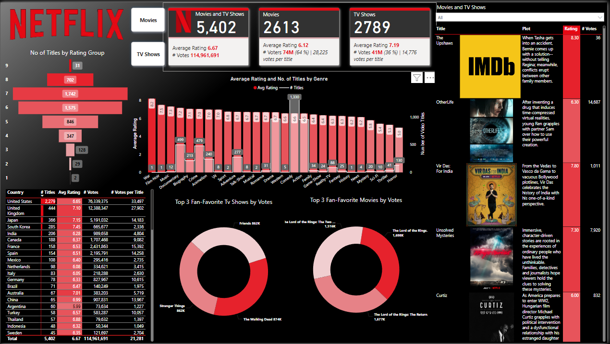

# Streaming Service Movie and TV Show Ratings Dashboard
Welcome to the Streaming Service Movie and TV Show Ratings Dashboard project! This repository contains an interactive Power BI dashboard that provides insights into movie and TV show ratings from various streaming platforms. The dashboard is designed to help understand viewer preferences, identify top-rated content, and analyze trends across different genres and platforms.

## 📊 Project Overview
This dashboard provides comprehensive insights into movie and TV show ratings, helping stakeholders make data-driven decisions.
The key features of the dashboard include the top 3 voted movies and TV shows and a Search bar to find specific titles and their ratings etc.

## 🛠️ Technologies Used
**Power BI**: Used to create interactive visualizations and dashboards.
**Excel**: Used for initial data cleaning and preprocessing.

## 🚀 Live Project
You can explore the live dashboard here: Streaming Ratings Dashboard
